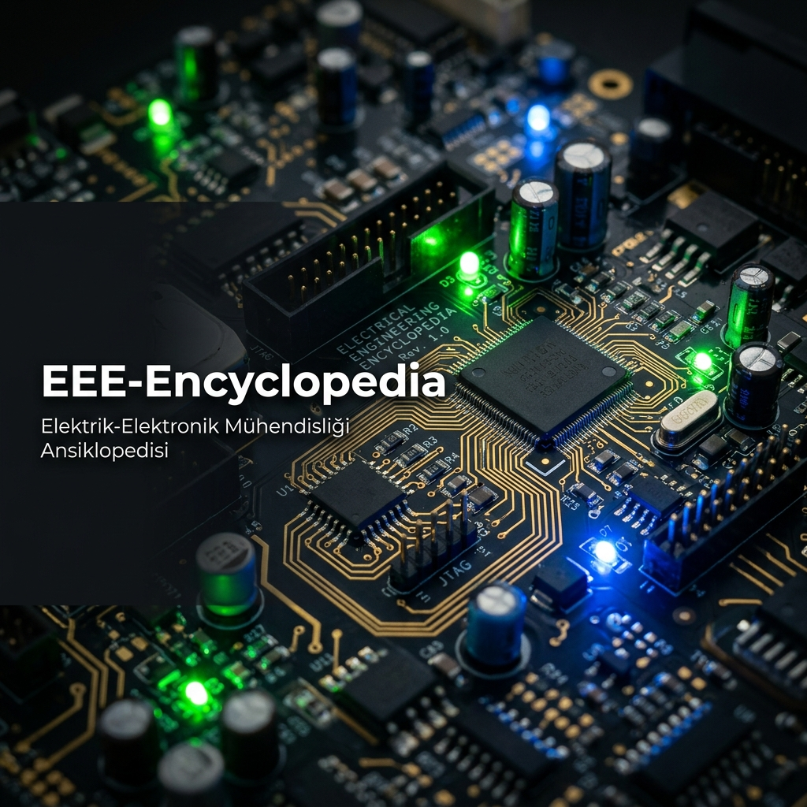

<div align="center">



# ⚡ EEE-Encyclopedia
### 🌌 THE DEFINITIVE ENGINEERING MASTERCLASS
*Elektrik-Elektronik Mühendisliği Ansiklopedisi*

[](https://opensource.org/licenses/MIT)
[]()
[]()
[]()
[]()
[]()

> *"Teoriden pratiğe, elektronun doğasından sistemin mimarisine."*

</div>

> [!IMPORTANT]
> **🚀 Post-AI Dönemine Geçiş Yapmak İsteyenler İçin:**
> Bu ansiklopedi, mühendisliğin klasik ve değişmez temellerini (Elektromanyetik, Devre Teorisi, Gömülü Sistemler vb.) devasa bir derinlikle (high-density) inceler. Eğer doğrudan **Edge-AI, Modern Robotik, Otonom Sistemler ve Geleceğin Ar-Ge Metodolojilerine** odaklanmak istiyorsanız, resmi ileri düzey küratörlüğümüze geçiniz:
> ➡️ **[Post-AI-EEE-Curriculum](https://github.com/arch-yunus/Post-AI-EEE-Curriculum)**

---

## 🦅 Vizyon: Sarsılmaz Temeller (Unshakeable Foundations)

**EEE-Encyclopedia**, sıradan bir akademik not deposu değildir. Bir mühendisin donanım hızlandırmalı otonom sistemler veya yapay zeka tasarlamadan önce zihinsel olarak geçmesi gereken **"Katı Hal, Elektromanyetik ve Devre Teorisi"** ateş çemberidir.

**"System Architect"** olmanın yolu, sinyalin pürüzsüz akışına ve elektronun matematiğine mutlak suretle hakim olmaktan geçer. Maxwell denklemlerini göremeyen bir zihin, otonom sistemlere yön veremez. Bu kütüphane, sizi devasa vizyonlara hazırlayan yüksek yoğunluklu (*high-density*) bir temel mühendislik klasikler ağıdır.

> *"The ability to control electrons is the ability to control the future."*

---

## 📊 Ansiklopedi İstatistikleri

<div align="center">

| Metrik | Değer |
|:---:|:---:|
| 📁 Ana Katman | 5 |
| 📄 Teknik Doküman | 20+ |
| 🔬 Masterclass Modülü | 5 |
| 📐 Formül & Denklem | 60+ |
| 🏭 Endüstriyel Standart | IEEE, IPC, MIL-STD, DO-254, IEC 61508 |

</div>

---

## 🏛️ Mimari Katmanlar (The 5-Layer Architecture)

Proje, temel fizikten endüstriyel seri üretime kadar tam ölçekli bir teknoloji geliştirme süreci sunan **5 Ana Katman** üzerine inşa edilmiştir.

---

### 📚 Katman 1: Akademik Temeller (The Foundations)
*Mühendisliğin değişmez gerçekleri ve fiziksel sınırları.*

| Konu | Derinlik | Masterclass |
|---|---|---|
| ⚡ Devre & Ağ Analizi | Nodal/Mesh Matrisleri, Thevenin, RLC Transient | — |
| 🧲 Elektromanyetik Teori | Maxwell (İntegral+Diferansiyel), Poynting, Dalga | [🔗 Smith Chart & RF](01_Akademik_Temeller/02_Elektromanyetik/01_Advanced_RF_Smith_Chart.md) |
| 📡 Sinyaller ve Sistemler | LTI, Fourier/Laplace, S-Plane Kutupları | [🔗 Kalman & LQR](01_Akademik_Temeller/03_Sinyaller_ve_Sistemler/01_Kalman_ve_Optimal_Kontrol.md) |
| 🔋 Yarı İletken Fiziği | Band Teorisi, P-N Jonksiyon, MOSFET Kuantum Limitleri | — |

---

### 💻 Katman 2: Yazılım ve Simülasyon (Digital Lab)
*Fiziksel dünyayı bükmeden önce manipüle ettiğimiz dijital ikizler.*

* **Matematiksel Modelleme:** MATLAB & Simulink ile non-lineer sistemlerin gelişmiş *state-space* (durum uzayı) dizaynı. `ss()`, `tf()`, `bode()`, `step()` fonksiyonlarının endüstriyel kullanımı.
* **Elektronik Simülasyon:** LTspice, PSpice ile Monte Carlo varyasyon testleri ve Post-Layout parazitik ekstraksiyonu.
* **Programlama Ekosistemi:**
    * **C/C++:** Gömülü donanımı manipüle eden, bellek yönetimini atomik seviyeye indiren (pointers, bitwise operations) ana dil.
    * **Python (NumPy/SciPy):** Butterworth/Chebyshev filtre tasarımı, FFT tabanlı spektrum analizi ve Kalman filtresi simülasyonları.

---

### 🤖 Katman 3: Gömülü Sistemler ve Robotik (Embedded & Robotics)
*Silikon tabanlı zekanın sensörler ve aktüatörler aracılığıyla gerçek dünyada vücut bulduğu seviye.*

| Konu | İçerik | Masterclass |
|---|---|---|
| 🔧 STM32 & MCU Mimarisi | HAL/LL/Bare-Metal, Clock/GPIO/DMA | — |
| ⏱️ FreeRTOS & RTOS | Task Scheduling, Mutex, Semaphore, IPC | [🔗 RTOS Masterclass](03_Gomulu_Sistemler_ve_Robotik/02_Isletim_Sistemleri/01_RTOS_Masterclass_Cortex_M.md) |
| 🤖 ROS2 & Navigasyon | Node/Topic, Nav2, SLAM, EKF Localization | — |
| 🧠 Edge-AI | NVIDIA Jetson, TensorRT, Model Quantization | — |

---

### 📐 Katman 4: Donanım Tasarımı (Hardware Design - PCB)
*Kodun ve algoritmaların fiziksel prototiplere evrildiği nihai Ar-Ge katmanı.*

* **Şematik Geliştirme:** Kritik komponent seçimi, BOM optimizasyonu ve fonksiyonel blok diyagram yönetimi.
* **PCB Layout & Routing:** Altium Designer / KiCad ile empedans kontrollü routing (50Ω Microstrip, 100Ω LVDS), EMI/EMC koruma teknikleri.
* **Sinyal & Güç Bütünlüğü (SI/PI):** PDN hedef empedans hesabı, Anti-Resonance analizi. → [🔗 SI/PI/EMC Masterclass](04_Donanim_Tasarimi/01_Masterclass_SI_PI_EMC.md)
* **Üretim (DFM/DFA):** Gerber/NC Drill çıktıları ve IPC-2221 tasarım standartları.

---

### 🚀 Katman 5: Kariyer ve Endüstri (Professional Path)
*Mühendisin sahaya inme, sektörel tahakküm kurma ve "Elite System Architect" markalaşması süreci.*

* **Savunma Sanayii:** MIL-STD-810 çevre testleri, DO-254/DO-178C sertifikasyon hiyerarşisi ve IEC 61508 Fonksiyonel Güvenlik temelleri. → [🔗 Systems Engineering Masterclass](05_Kariyer_ve_Endustri/01_Masterclass_Systems_Engineering.md)
* **TEKNOFEST & KDR:** Yönetici özeti → sistem mimarisi → detaylı tasarım → V&V planı → FMEA sıralamasıyla profesyonel rapor anatomisi.
* **Sertifikasyon:** Siber Vatan, BTK ve IEEE tabanlı global yetkinlik yolları.

---

## 🗺️ Tam İçerik Haritası (Full Content Map)

```
EEE-Encyclopedia/
│
├── 📂 01_Akademik_Temeller/
│   ├── 01_Devre_Analizi/          → Nodal/Mesh, Thevenin, RLC Diferansiyel Denklemleri
│   ├── 02_Elektromanyetik/        → Maxwell ×4, Poynting Vektörü
│   │   └── 01_Advanced_RF_Smith_Chart.md  ★ MASTERCLASS
│   ├── 03_Sinyaller_ve_Sistemler/ → LTI, Fourier/FFT, Laplace, S-Plane
│   │   └── 01_Kalman_ve_Optimal_Kontrol.md ★ MASTERCLASS
│   └── 04_Yari_Iletken_Fizigi/   → Band Theory, P-N Junction, MOSFET Küantum
│
├── 📂 02_Yazilim_ve_Simulasyon/
│   ├── 01_Matematiksel_Modelleme/ → State-Space, MATLAB Tools
│   ├── 02_Devre_Simulasyonu/      → SPICE, LTspice, Monte Carlo
│   └── 03_Programlama/
│       ├── C_Cpp/                 → Bare-metal, Pointer Arithmetic
│       └── Python/                → DSP, Butterworth Filter, FFT Simülasyonu
│
├── 📂 03_Gomulu_Sistemler_ve_Robotik/
│   ├── 01_Mikrodenetleyiciler/STM32/  → ARM Pipeline, HAL/LL/Bare-Metal, DMA
│   ├── 02_Isletim_Sistemleri/         → FreeRTOS, Task, Priority Inversion
│   │   └── 01_RTOS_Masterclass_Cortex_M.md  ★ MASTERCLASS
│   ├── 03_Modern_Robotik/             → ROS2, Nav2, SLAM, DDS
│   └── 04_Kenar_Yapay_Zeka/           → Jetson, TensorRT, Quantization
│
├── 📂 04_Donanim_Tasarimi/
│   ├── 01_Masterclass_SI_PI_EMC.md   ★ MASTERCLASS
│   ├── 01_Sematik_Cizim/             → BOM, ERC, Hierarchical Design
│   ├── 02_PCB_Layout/                → Stackup, Impedance Control, DDR Routing
│   └── 03_Araclar/                   → Altium, KiCad, Gerber
│
└── 📂 05_Kariyer_ve_Endustri/
    ├── 01_Masterclass_Systems_Engineering.md  ★ MASTERCLASS
    ├── 01_Sektor_Analizi/             → Savunma, Otomotiv, Tüketici Elektroniği
    ├── 02_Sertifikasyonlar/           → Siber Vatan, BTK, IEEE
    └── 03_TEKNOFEST_Rehberi/          → KDR Anatomisi, FMEA, V&V
```

---

## ⚡ Temel Mühendislik İlkeleri (Engineering First Principles)

Her iyi mühendis, bu denklemlerin sadece formül değil — evrenin işleyiş kodu olduğunu bilir:

```
Maxwell Denklemleri (Tüm EM fenomeninin temeli):
  ∇·E = ρ/ε₀          → Gauss (Elektrik)
  ∇·B = 0              → Gauss (Manyetik)
  ∇×E = −∂B/∂t        → Faraday
  ∇×B = μ₀J + μ₀ε₀∂E/∂t → Ampère-Maxwell

Kalman Filtresi (Sensör füzyonunun kalbi):
  x̂ₖ = Axₖ₋₁ + Buₖ            [Tahmin]
  Kₖ = PₖHᵀ(HPₖHᵀ + R)⁻¹      [Kazanç]
  x̂ₖ = x̂ₖ + Kₖ(zₖ − Hx̂ₖ)     [Güncelleme]

Fourier Dönüşümü (Zaman→Frekans köprüsü):
  X(jω) = ∫ x(t)e^(−jωt) dt

Karakteristik Empedans (PCB hat tasarımının temeli):
  Z₀ = √(L'/C')  →  50Ω (RF standardı)
```

---

## 🛠️ Nasıl Katkı Sağlanır? (Governance & Contribution)

Bizler, kalite standartlarından ödün vermeyen **elit bir mühendislik topluluğu** oluşturmayı hedefliyoruz. Katkılarınız mutlak suretle global literatür standartlarını karşılamalıdır.

1. **Fork:** Repoyu kendi ortamınıza alın.
2. **Branch:** `git checkout -b feature/Kalman-Filter-Derivation`
3. **Commit:** Semantic Commit zorunludur → `feat(electromagnetics): add cavity resonator derivation`
4. **Pull Request:** Akademik kaynak veya simülasyon kanıtıyla birlikte Peer-Review'a açın.

---

## 📅 Monolithic Task Tracking (Monk Mode)
- [x] **Aşama 1:** Yüksek yoğunluklu sınıf & dizin mimarisinin oluşturulması.
- [x] **Aşama 2:** Profesyonel Markdown Şablonları & Lisanslama yapılandırması.
- [x] **Aşama 3:** Tüm akademik ve endüstriyel katmanların (STM32, PCB, AI, RTOS) içeriklerle doldurulması.
- [x] **Aşama 4:** "The Definitive Engineering Masterclass" vizyonunun tamamlanması.
- [x] **Aşama 5:** 5 adet Elite Masterclass modülünün (RF, Kalman, RTOS, SI/PI, Systems Eng.) yayınlanması.

---

## 🛡️ Lisans
Proje ekosistemi, açık ve inovatif Ar-Ge kültürünü küresel ölçekte desteklemek adına tam donanımlı [MIT Lisansı](LICENSE) kapsamında halka açılmıştır. Etik sınırlar çerçevesinde endüstriyel ve akademik çalışmalarınızda serbestçe kaynak gösterilebilir.

---

<div align="center">

| **Founder / System Architect** | **Research Organization** | **Deep-Tech Venture** |
|:---:|:---:|:---:|
| [Bahattin Yunus Çetin](https://github.com/arch-yunus) | Meta-Engineering Research Lab | Anka Silicon Dynamics |

*© 2026 EEE-Encyclopedia · All Rights Reserved · Master the Foundations.*

</div>
